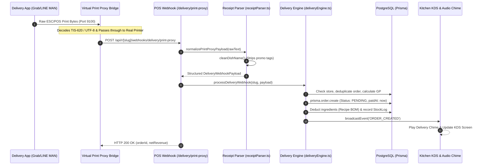

# Architecture Document: ORDEO POS (pos-restaurant-app)

> **Document Version**: 1.0.0  
> **Source Repository**: `https://github.com/kitsada1984/pos-restaurant-app.git`  
> **Branch**: `main`  
> **HEAD Commit**: `f24d96e32a271217a60032cd75ef4c4304b90b66`  
> **Snapshot Date**: 2026-09-21  
> **Audited By**: Antigravity Agent (`doc-and-modernize` skill)

---

## Executive Summary

**ORDEO POS (`pos-restaurant-app`)** is a full-stack, multi-tenant Restaurant Point-of-Sale (POS) and Kitchen Display System (KDS) designed for small to medium-sized restaurants and street food establishments. Built on **Next.js 14 (App Router)**, **TypeScript**, **Tailwind CSS**, and **Prisma ORM with PostgreSQL (Supabase)**, the application coordinates dine-in table ordering, cashless payments via Bank of Thailand EMVCo PromptPay Dynamic QR codes, hybrid slip OCR verification, automated recipe Bill of Materials (BOM) inventory deductions, and multi-channel delivery order ingestion (LINE MAN, GrabFood, ShopeeFood, Robinhood) via an untraceable, zero-cost **Virtual Print Proxy** mechanism.

---

## Part 1 — Whole-Repo Technical Deep-Dive

### 1.1 Tech-Stack Detection

| Layer | Technology | Evidence (File + Line) | Status |
| :--- | :--- | :--- | :--- |
| **Framework** | Next.js 14.2.15 (App Router, Server Actions, Route Handlers) | [package.json#L24](file:///c:/Users/kitsa/Documents/posร้านตามสั่ง/package.json#L24) | Active |
| **Runtime** | Node.js v20+ / Vercel Serverless Functions | [package.json#L35](file:///c:/Users/kitsa/Documents/posร้านตามสั่ง/package.json#L35) | Active |
| **Language** | TypeScript 5.6.3 | [package.json#L42](file:///c:/Users/kitsa/Documents/posร้านตามสั่ง/package.json#L42), [tsconfig.json#L1](file:///c:/Users/kitsa/Documents/posร้านตามสั่ง/tsconfig.json#L1) | Strict |
| **Styling** | Tailwind CSS 3.4.14, PostCSS, Autoprefixer | [tailwind.config.ts#L1](file:///c:/Users/kitsa/Documents/posร้านตามสั่ง/tailwind.config.ts#L1), [package.json#L41](file:///c:/Users/kitsa/Documents/posร้านตามสั่ง/package.json#L41) | Active |
| **ORM & DB Client** | Prisma Client 5.21.1 / 5.22.0 | [prisma/schema.prisma#L1-L9](file:///c:/Users/kitsa/Documents/posร้านตามสั่ง/prisma/schema.prisma#L1-L9), [package.json#L16](file:///c:/Users/kitsa/Documents/posร้านตามสั่ง/package.json#L16) | Active |
| **Database** | PostgreSQL (Supabase Connection Pooling + Direct URL) | [prisma/schema.prisma#L6-L9](file:///c:/Users/kitsa/Documents/posร้านตามสั่ง/prisma/schema.prisma#L6-L9) | Active |
| **Auth & Sessions** | JWT via `jose` (HS256) + `bcryptjs` password hashing | [src/lib/auth.ts#L1-L40](file:///c:/Users/kitsa/Documents/posร้านตามสั่ง/src/lib/auth.ts#L1-L40), [package.json#L21](file:///c:/Users/kitsa/Documents/posร้านตามสั่ง/package.json#L21) | Active |
| **Realtime Sync** | Server-Sent Events (SSE) stream via in-memory `EventEmitter` | [src/lib/events.ts#L1-L35](file:///c:/Users/kitsa/Documents/posร้านตามสั่ง/src/lib/events.ts#L1-L35), [src/lib/realtimeManager.ts#L1-L60](file:///c:/Users/kitsa/Documents/posร้านตามสั่ง/src/lib/realtimeManager.ts#L1-L60) | Active (Local) |
| **Audio Synthesizer** | Web Audio API Oscillator synthesizer (no external audio files) | [src/lib/sound.ts#L1-L120](file:///c:/Users/kitsa/Documents/posร้านตามสั่ง/src/lib/sound.ts#L1-L120) | Active |
| **Payment Protocol** | PromptPay EMVCo Payload Generator (`promptpay-qr`, CRC16-CCITT) | [src/lib/promptpay.ts#L1-L50](file:///c:/Users/kitsa/Documents/posร้านตามสั่ง/src/lib/promptpay.ts#L1-L50), [package.json#L26](file:///c:/Users/kitsa/Documents/posร้านตามสั่ง/package.json#L26) | Active |
| **Slip OCR & QR** | `jsqr` browser QR reader + Hybrid Slip Provider (SlipOK/EasySlip) | [src/lib/slip-verifier.ts#L1-L80](file:///c:/Users/kitsa/Documents/posร้านตามสั่ง/src/lib/slip-verifier.ts#L1-L80), [package.json#L22](file:///c:/Users/kitsa/Documents/posร้านตามสั่ง/package.json#L22) | Active |
| **Delivery Ingestion** | Virtual Print Proxy ESC/POS Raw Stream Decoder (Port 9100) | [src/lib/receiptParser.ts#L1-L150](file:///c:/Users/kitsa/Documents/posร้านตามสั่ง/src/lib/receiptParser.ts#L1-L150), [scripts/print-proxy-companion.js#L1-L60](file:///c:/Users/kitsa/Documents/posร้านตามสั่ง/scripts/print-proxy-companion.js#L1-L60) | Active |

---

### 1.2 Entry Points & Routing Map

```text
src/app/
├── (Root)
│   ├── page.tsx                           # Landing / Store Selection / Auth redirection
│   ├── login/page.tsx                     # Tenant & Platform Admin Authentication
│   └── register/page.tsx                  # New Tenant Store Onboarding
├── r/[slug]/                              # Multi-Tenant Core Scoped Surface
│   ├── pos/page.tsx                       # Cashier & Interactive Table Layout (PosTerminal)
│   ├── kitchen/page.tsx                   # Kitchen Display System KDS (KitchenTerminal)
│   ├── table/[id]/page.tsx                # Customer Self-Ordering via QR (CustomerOrderingView)
│   └── admin/
│       ├── menu/page.tsx                  # Menu Management, Categories, Out-of-stock switches
│       ├── tables/page.tsx                # Table Layout & QR Code generator
│       ├── inventory/page.tsx             # Recipe BOM & Raw Ingredient Stock Management
│       ├── reports/page.tsx               # Sales Reports, Daily Cash/PromptPay & GP analytics
│       ├── promotions/page.tsx            # Loyalty points & Discount coupons
│       ├── qr-codes/page.tsx              # Printable A4 QR Code Sheets
│       └── settings/page.tsx              # Store config, Bank Webhooks, Print Proxy Hub
├── platform-admin/                        # Super Admin Control Plane
│   ├── page.tsx                           # SaaS Platform Dashboard & Global Metrics
│   ├── stores/page.tsx                    # Tenant Store Directory & Quota Control
│   ├── subscriptions/page.tsx             # Subscription Billing Approval
│   └── settings/page.tsx                  # Platform PromptPay & System Parameters
└── api/
    ├── auth/                              # JWT Login, Registration, Logout
    ├── r/[slug]/                          # Scoped Tenant API Gateways (22 Route Handlers)
    │   ├── orders/                        # Order lifecycle (GET, POST, PATCH by ID, Pay)
    │   ├── menu/                          # Menu & Category CRUD, Availability toggle
    │   ├── tables/                        # Table CRUD & Session control
    │   ├── inventory/                     # Ingredients & Recipe BOM CRUD
    │   ├── stream/                        # Server-Sent Events (SSE) Real-time pipe
    │   ├── reports/daily/                 # Timezone-aware (UTC+7) financial aggregation
    │   └── webhooks/
    │       ├── bank-notify/               # Automated Bank SMS/Email notification intake
    │       └── delivery/print-proxy/      # Virtual Print Proxy ESC/POS intake
    └── (Legacy Unscoped API Fallbacks)    # /api/orders, /api/tables, /api/menu (hardcoded slug)
```

---

### 1.3 Commands & Verification Inventory

| Command | Purpose | Verification Source | CI Enforced? |
| :--- | :--- | :--- | :--- |
| `npm run dev` | Starts local Next.js dev server on `0.0.0.0:3000` | [package.json#L6](file:///c:/Users/kitsa/Documents/posร้านตามสั่ง/package.json#L6) | No |
| `npm run build` | Generates Prisma client and creates production Next.js build | [package.json#L7](file:///c:/Users/kitsa/Documents/posร้านตามสั่ง/package.json#L7) | Vercel (Auto) |
| `npm run start` | Runs production server locally on port 3000 | [package.json#L8](file:///c:/Users/kitsa/Documents/posร้านตามสั่ง/package.json#L8) | No |
| `npm run lint` | Runs Next.js ESLint verification | [package.json#L9](file:///c:/Users/kitsa/Documents/posร้านตามสั่ง/package.json#L9) | No |
| `npx tsc --noEmit` | Strict TypeScript type checking across all 29 routes | Verified via terminal (Exit 0) | `[UNVERIFIED]` in CI |
| `npm run prisma:generate` | Emits Prisma client into `node_modules/@prisma/client` | [package.json#L10](file:///c:/Users/kitsa/Documents/posร้านตามสั่ง/package.json#L10) | Auto on build |
| `npm run prisma:push` | Synchronizes database schema with PostgreSQL directly | [package.json#L11](file:///c:/Users/kitsa/Documents/posร้านตามสั่ง/package.json#L11) | Manual |
| `npm run prisma:seed` | Seeds initial tenant stores, tables, and sample menus | [package.json#L12](file:///c:/Users/kitsa/Documents/posร้านตามสั่ง/package.json#L12) | Manual |

> [!WARNING]
> **Testing Gap**: Currently there is **no automated test command** (`npm test`) configured in `package.json`. No Jest or Vitest dependencies are present. Automated safety currently relies on static typecheck (`npx tsc --noEmit`) and Next.js compiler checks (`npm run build`).

---

### 1.4 Deployment & Runtime Surface

| Dimension | Pinned Version / Setting | Location (File + Line) | Drift / Risk |
| :--- | :--- | :--- | :--- |
| **Node.js Engine** | Node 20.x (LTS) | Implicit via types `@types/node: ^20.17.0` | Node 20 / 22 compatible |
| **Next.js** | `14.2.15` (Resolved: `14.2.35`) | [package.json#L24](file:///c:/Users/kitsa/Documents/posร้านตามสั่ง/package.json#L24) | Next.js 15 breaking changes pending |
| **React** | `18.3.1` | [package.json#L28](file:///c:/Users/kitsa/Documents/posร้านตามสั่ง/package.json#L28) | React 19 upgrade path available |
| **Prisma Engine** | `5.21.1` (Resolved: `5.22.0`) | [package.json#L16](file:///c:/Users/kitsa/Documents/posร้านตามสั่ง/package.json#L16) | Prisma 8 available in preview |
| **Hosting** | Vercel Serverless Platform (`pos-restaurant-app-psi.vercel.app`) | [.vercel/project.json](file:///c:/Users/kitsa/Documents/posร้านตามสั่ง/.vercel/project.json) | Stateless serverless execution |
| **Database** | Supabase Managed PostgreSQL | `DATABASE_URL` (Pooler) / `DIRECT_URL` (Direct) | Shared connection pool |

---

## Part 2 — Context & Ecosystem

### 2.1 Checkout Identity

* **Repository**: `https://github.com/kitsada1984/pos-restaurant-app.git`
* **Branch**: `main`
* **Head Commit**: `f24d96e32a271217a60032cd75ef4c4304b90b66`
* **License**: Private
* **Timezone Standard**: `Asia/Bangkok` (UTC+7) enforced across report calculations ([reports/daily/route.ts#L22](file:///c:/Users/kitsa/Documents/posร้านตามสั่ง/src/app/api/r/[slug]/reports/daily/route.ts#L22)).

---

## Part 3 — Architectural Blueprint

### 3.1 C4 Architecture Diagram (System Context & Containers)

```mermaid
flowchart TB
    subgraph Clients ["Client Layer (Devices)"]
        POS_UI["📱 Cashier POS Terminal\n(Tablet / PC)"]
        KDS_UI["👨‍🍳 Kitchen KDS Display\n(Tablet / Screen)"]
        CUST_UI["📱 Customer Mobile Web\n(QR Self-Order)"]
        PROXY_COMPANION["🖨️ Virtual Print Proxy Bridge\n(Local Node.js / Android Port 9100)"]
    end

    subgraph ExternalPlatforms ["External Systems"]
        DELIVERY_APPS["🛵 GrabMerchant / LINE MAN /\nShopee Partner Apps"]
        BANK_GATEWAYS["🏦 Mobile Banking Apps\n(KBANK, SCB, KTB, BBL)"]
        GOOGLE_DRIVE["📁 Google Drive\n(Slip Storage via GAS)"]
    end

    subgraph ApplicationCore ["Next.js 14 App Router (Vercel Serverless)"]
        ROUTER["API Gateways & Dynamic Routes\n(/r/[slug]/*)"]
        AUTH_MODULE["Auth & Session Module\n(jose / JWT)"]
        DELIVERY_ENG["Delivery Engine & Parser\n(receiptParser & deliveryEngine)"]
        PAYMENT_ENG["Payment & QR Engine\n(promptpay & slip-verifier)"]
        INVENTORY_ENG["Recipe BOM Engine\n(Stock Deduction & Logs)"]
        SSE_BUS["Event Bus & Streamer\n(events.ts / SSE)"]
    end

    subgraph DatabaseLayer ["Data Layer (Supabase)"]
        PG_DB[("PostgreSQL Database\n(Prisma ORM)")]
    end

    DELIVERY_APPS -->|ESC/POS Print Stream| PROXY_COMPANION
    PROXY_COMPANION -->|POST /api/r/[slug]/webhooks/delivery/print-proxy| DELIVERY_ENG
    
    CUST_UI -->|Order Placed| ROUTER
    POS_UI -->|Cash / QR / Status Update| ROUTER
    KDS_UI -->|Cooking State Updates| ROUTER

    ROUTER --> AUTH_MODULE
    ROUTER --> DELIVERY_ENG
    ROUTER --> PAYMENT_ENG
    ROUTER --> INVENTORY_ENG

    DELIVERY_ENG --> INVENTORY_ENG
    DELIVERY_ENG --> SSE_BUS
    PAYMENT_ENG --> SSE_BUS

    DELIVERY_ENG --> PG_DB
    PAYMENT_ENG --> PG_DB
    INVENTORY_ENG --> PG_DB

    SSE_BUS -.->|Realtime Event Stream| POS_UI
    SSE_BUS -.->|Realtime Event Stream| KDS_UI

    BANK_GATEWAYS -.->|Push Notification / Email| ROUTER
    PAYMENT_ENG -.->|Backup Slips| GOOGLE_DRIVE
```

---

### 3.2 Cross-Cutting Concerns

| Concern | Implementation | Evidence |
| :--- | :--- | :--- |
| **Multi-Tenancy** | URL Slug scoping (`/r/[slug]/...`) + DB Store foreign keys | [src/lib/auth.ts#L65](file:///c:/Users/kitsa/Documents/posร้านตามสั่ง/src/lib/auth.ts#L65) |
| **Inventory Control** | Recipe Bill of Materials (BOM) deduction on order acceptance; increment on cancel | [src/lib/deliveryEngine.ts#L363-L386](file:///c:/Users/kitsa/Documents/posร้านตามสั่ง/src/lib/deliveryEngine.ts#L363-L386) |
| **Delivery Reconciliation** | Platform-specific GP deduction (LINE MAN, Grab, ShopeeFood) & net profit calculation | [src/lib/deliveryEngine.ts#L322-L330](file:///c:/Users/kitsa/Documents/posร้านตามสั่ง/src/lib/deliveryEngine.ts#L322-L330) |
| **Slip Anti-Fraud** | Duplicate QR hash/TransRef detection + exact amount matching | [src/lib/slip-verifier.ts#L35-L65](file:///c:/Users/kitsa/Documents/posร้านตามสั่ง/src/lib/slip-verifier.ts#L35-L65) |
| **Printer Integration** | ESC/POS Command Generator (58mm / 80mm) + Web Bluetooth / Raw Socket support | [src/lib/thermalPrinter.ts#L1-L150](file:///c:/Users/kitsa/Documents/posร้านตามสั่ง/src/lib/thermalPrinter.ts#L1-L150) |

---

### 3.3 Subsystem Deep-Dive 1: Virtual Print Proxy Delivery Hub



---

## Part 4 — Confidence Assessment

| Architectural Domain | Confidence | Justification |
| :--- | :---: | :--- |
| **Tech Stack & Manifests** | **High** | Read directly from `package.json`, `tsconfig.json`, `schema.prisma`. |
| **Command Inventory** | **High** | Verified via terminal execution of `npm run build` and `npx tsc --noEmit`. |
| **Delivery & Print Proxy Engine** | **High** | Verified through end-to-end integration test (`scratch/test-print-proxy.ts`). |
| **Database & Models** | **High** | Inspected all 14 models directly in `prisma/schema.prisma`. |
| **Realtime Scalability on Serverless** | **High (Risk Identified)** | `events.ts` uses local in-memory `EventEmitter`; multi-container sync requires fallback polling. |
| **Test Automation Coverage** | **Low** | No test runner configured in repository. |

---

## Part 5 — Footnotes & Key File Index

1. [`package.json`](file:///c:/Users/kitsa/Documents/posร้านตามสั่ง/package.json): Root configuration, dependencies, and execution scripts.
2. [`prisma/schema.prisma`](file:///c:/Users/kitsa/Documents/posร้านตามสั่ง/prisma/schema.prisma): Multi-tenant relational schema (Store, Order, MenuItem, Ingredient, Recipe, Member).
3. [`src/lib/deliveryEngine.ts`](file:///c:/Users/kitsa/Documents/posร้านตามสั่ง/src/lib/deliveryEngine.ts): Central delivery processing, GP deduction, and stock deduction.
4. [`src/lib/receiptParser.ts`](file:///c:/Users/kitsa/Documents/posร้านตามสั่ง/src/lib/receiptParser.ts): ESC/POS raw text decoder and promo-tag dish cleaner.
5. [`scripts/print-proxy-companion.js`](file:///c:/Users/kitsa/Documents/posร้านตามสั่ง/scripts/print-proxy-companion.js): Companion print proxy bridge daemon.
6. [`src/components/tenant/PosTerminal.tsx`](file:///c:/Users/kitsa/Documents/posร้านตามสั่ง/src/components/tenant/PosTerminal.tsx): Cashier POS UI, table layout, and delivery order queue.
7. [`src/hooks/useKitchenOrders.ts`](file:///c:/Users/kitsa/Documents/posร้านตามสั่ง/src/hooks/useKitchenOrders.ts): Kitchen KDS state manager, audio synth controller, and auto-print driver.
